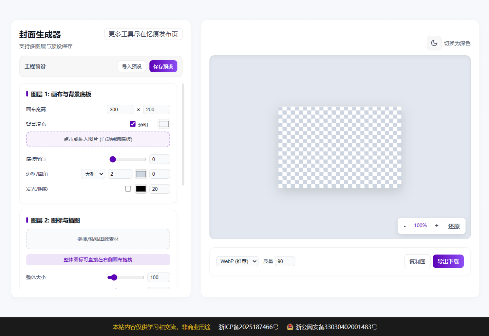

#  封面生成器

该项目是基于原作者 [amiaoapp](https://github.com/amiaoapp/) 的 [img2banner](https://github.com/amiaoapp/img2banner) 项目的二次修改版本。

一款专为博主、开发者和自媒体人打造的“极简封面制作工具”。无需下载庞大的 Photoshop，只需一个 HTML 文件，即可在浏览器中完成专业级文章封面、缩略图或 Banner 的设计。

纯javascript实现，直接单文件部署，离线随便用。

演示地址：https://coverdesign.937788.xyz

##  核心特性

-  **极简架构**：纯原生 Vanilla JS 开发，单文件、零依赖，即开即用。
-  **三层合成体系**：
  - **图层 1 (背景层)**：支持纯色、透明背景或上传背景图（自动 Cover 填充）。
  - **图层 2 (中心图标)**：支持拖拽上传/剪贴板粘贴，内置裁切引擎，支持 GIF 取首帧。
  - **图层 3 (文本层)**：支持输入多行文字，调用**本地系统字体**，支持文字背景色块。
- ️ **所见即所得**：
  - **画布拖拽**：直接在右侧预览区用鼠标拖动图标和文字位置，告别死板的坐标调节。
  - **滚轮缩放**：支持滚轮缩放画布视图，轻松调整像素级细节。
-  **高级视觉效果**：
  - **弥散阴影**：复刻 Apple 风格的拟物化发光阴影效果。
  - **智能边框与圆角**：每个图层均支持独立设置实线/虚线边框及圆角半径。
-  **专业级导出**：
  - 支持 WebP (推荐)、PNG、JPEG 格式。
  - 内置**图片压缩功能**，自由调节输出质量与文件大小。
  - **一键复制**：支持直接将生成的图片（带透明度）复制到剪贴板。
-  **双色主题**：内置浅色/深色模式切换，适配你的创作环境。

## ️ 使用方法

1. **直接运行**：下载并双击打开 `index.html`（或将其部署在任何静态服务器上）。
2. **导入素材**：
   - 拖拽图片到上传区，或直接按 `Ctrl+V` (Cmd+V) 粘贴。
   - 在左侧面板上传背景图。
3. **排版设计**：
   - 在右侧画布直接**鼠标左键拖拽**图标和文字到满意的位置。
   - 使用**鼠标滚轮**缩放画布，观察边缘细节。
4. **保存分享**：
   - 选择输出格式和质量，点击“导出下载”，或直接点击“复制图”发送到社交平台。

##  许可证

基于 MIT License 开源。

## 效果截图

